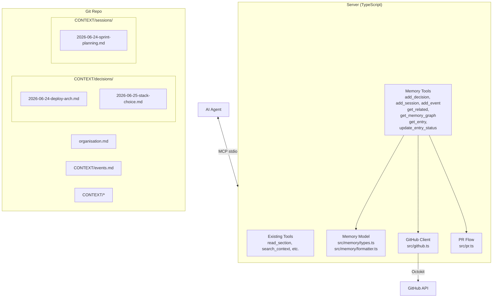
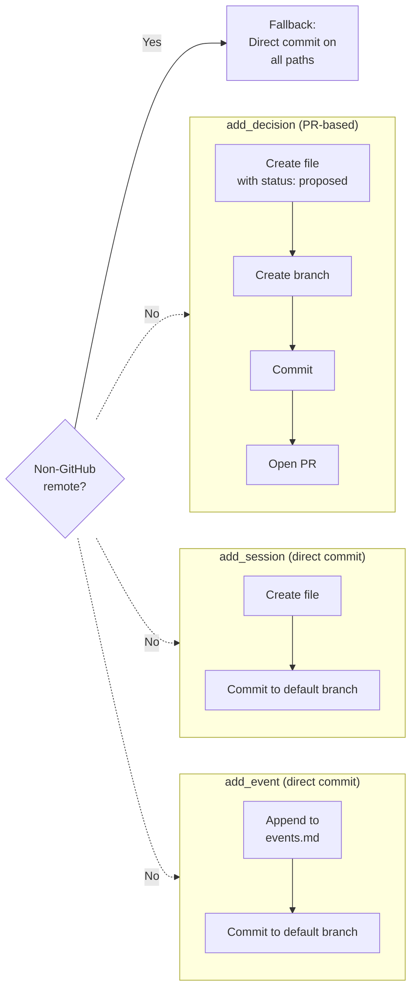

# feat: git-native memory layer

## Summary

Extend the existing `organisation.md` MCP server with a git-native memory layer — three append-only knowledge stores (decision log, session log, event log) plus automated extraction, semantic search, and a knowledge graph — all backed by git primitives with no external databases or hosted services.

---

## Problem Frame

Every AI agent session starts cold — no memory of previous conversations, no automated capture of decisions made during agent work, no graph of how knowledge connects. Teams using AI agents at scale need persistent memory that accumulates automatically, is searchable across all stored knowledge, and reveals relationships between entries — all while staying git-native so there is no hosted service, no vector DB, and no infrastructure to manage.

The existing server reads and writes `organisation.md` but has no append-only log layer, no automated capture, no cross-entry search, and no relationship graph. Agents re-explain context and decisions get lost in chat history.

---

## Requirements

### Memory stores

- R1. Append-only decision log at `CONTEXT/decisions/`, one file per decision with filename `YYYY-MM-DD-slug.md`.
- R2. Each decision file MUST have YAML frontmatter with fields: `date`, `status` (proposed/accepted/superseded), `decided_by`, `type` (decision), `related` (array of paths).
- R3. Each decision body body captures: Context, Decision, Rationale, Alternatives considered.
- R4. Append-only session log at `CONTEXT/sessions/`, one file per session `YYYY-MM-DD-slug.md`.
- R5. Each session file MUST have YAML frontmatter with: `date`, `type` (session), `decisions` (array of paths), `related` (array of paths).
- R6. Append-only event log at `CONTEXT/events.md` with entries appended to file bottom. Each entry: date, type, description, optional link.

### Automated extraction

- R7. `add_decision` tool — accepts structured input (context, decision, rationale, alternatives, decided_by, related), creates decision file with `status: proposed`, commits, opens PR.
- R8. `add_session` tool — accepts summary, decisions made, open questions, creates session file with direct commit.
- R9. `add_event` tool — accepts type, description, related, appends to `CONTEXT/events.md` with direct commit.
- R10. Auto-generate slug from title/summary — opt-in override via tool parameter.

### Semantic search

- R11. Extend `search_context` to search `organisation.md`, `CONTEXT/`, `CONTEXT/decisions/`, `CONTEXT/sessions/`, `CONTEXT/events.md`.
- R12. Support frontmatter field filtering: `status`, `type`, `date_from`, `date_to`.
- R13. Results include file path, entry title, and surrounding snippet.

### Knowledge graph

- R14. `get_related` tool — accepts file path, returns all entries linked via `related:` fields (inbound and outbound).
- R15. `get_memory_graph` tool — returns full entry-relationship map grouped by type with connections.
- R16. `get_entry` tool — accepts file path, returns full content of any memory entry.

### Decision lifecycle and integrity

- R17. Decisions default to `status: proposed`. Merging the PR or calling `update_entry_status` sets `status: accepted`.
- R18. Only `status` may be edited retroactively — body is immutable after creation.
- R19. `CONTEXT/events.md` is append-only — no edits or deletions.

### Server and existing tool updates

- R20. Server instructions field updated to describe memory layer and instruct agents to self-report decisions, sessions, and events.
- R21. The `## Decisions` section in `organisation.md` updated to reference the external decision log rather than duplicate entries.
- R22. Non-GitHub remotes fall back to direct commit on all write paths.

---

## Key Technical Decisions

| Decision | Rationale |
|---|---|
| One file per decision/session | Avoids merge conflicts on concurrent writes, clean diffs, individual git history. Events stay single-file since they are higher-frequency and lighter-weight. |
| YAML frontmatter + markdown body | Machine-parseable for search, human-readable for PR reviews, compatible with static site generators. |
| PR-based writes for decisions | Decisions shape org direction — they deserve review. Direct commit for sessions/events — they are operational and should be fast. |
| GitHub Search API for cross-file search | Avoids fetching every file individually. Falls back to `git grep` when GitHub API is unavailable. |
| Relationship traversal via `related:` fields | File-level link resolution at query time — no graph DB, no indexing infrastructure. |
| Agent self-reports (no conversation sniffing) | The MCP server provides tools; the agent's system prompt instructs it to call them. The server does not intercept or analyze chat content. |

---

## High-Level Technical Design

### Architecture



### Write path by entry type



### Knowledge graph traversal

```mermaid
flowchart TB
    Q[get_related\nCONTEXT/decisions/foo.md] --> Read[Read foo.md frontmatter]
    Read --> Outbound[Extract related: field]
    Read --> Inbound[Scan all memory files\nfor inbound links to foo.md]
    Outbound --> Merge[Merge and return]
    Inbound --> Merge
    Merge --> Result["[{path, title, type, direction:\"outbound\"},\n {path, title, type, direction:\"inbound\"}]"]
```

---

## Implementation Units

### U1. CONTEXT directory structure and template files

**Goal:** Create the directory structure and initialization logic for the three memory stores.

**Files:**
- `CONTEXT/decisions/.gitkeep`
- `CONTEXT/sessions/.gitkeep`
- `CONTEXT/events.md`
- `src/memory/init.ts`

**Requirements:** R1, R4, R6

**Approach:**
- Create empty directory placeholders for `decisions/` and `sessions/`
- Create `CONTEXT/events.md` with a YAML-style header block containing field definitions and a blank line before the first entry
- Add `src/memory/init.ts` that checks for the existence of these files on server startup and creates them if missing

**Patterns to follow:** The existing `CONTEXT/README.md` pattern for directory structure

**Test scenarios:**
- Server creates missing `CONTEXT/decisions/` and `CONTEXT/sessions/` on startup
- Server creates `CONTEXT/events.md` with correct header format on startup
- Server does not overwrite existing files
- Events.md header defines valid date, type, description, related fields

**Test expectation: none — pure scaffolding and initialization logic**

---

### U2. Memory entry model and formatting

**Goal:** TypeScript types for all memory entries and formatters that produce the correct YAML frontmatter + markdown body file format.

**Files:**
- `src/memory/types.ts`
- `src/memory/formatter.ts`
- `src/memory/parser.ts`

**Requirements:** R2, R3, R5

**Approach:**
- `types.ts`: Define `DecisionEntry`, `SessionEntry`, `EventEntry`, `MemoryEntry` union types with all required fields matching the YAML frontmatter schema
- `formatter.ts`: `formatDecision(entry)` returns a complete file string (YAML frontmatter + `---` + markdown body with Context/Decision/Rationale/Alternatives sections). `formatSession(entry)` returns session file. `formatEventEntry(entry)` returns a single event entry string for appending.
- `parser.ts`: `parseDecision(content)` extracts frontmatter fields via regex/frontmatter parsing and the markdown body. `parseEvents(content)` splits `CONTEXT/events.md` by entry boundaries and parses each. Slugify function: lowercase, replace spaces with hyphens, remove non-alphanumeric chars except hyphens.

**Patterns to follow:** The existing `src/parser.ts` pattern for section extraction

**Test scenarios:**
- `formatDecision` produces valid YAML frontmatter with all required fields
- `formatDecision` markdown body includes Context, Decision, Rationale, Alternatives sections
- `formatSession` correctly sets `type: session` in frontmatter
- `formatEventEntry` produces correct appendable entry with date prefix
- `parseDecision` correctly parses frontmatter from a formatted decision file
- `parseEvents` splits multiple events correctly
- `slugify("This is a Decision!")` returns `this-is-a-decision`
- `slugify("")` returns a fallback based on date hash

---

### U3. Decision write path (PR-based)

**Goal:** The `add_decision` tool that creates a decision file, commits it to a branch, and opens a PR.

**Files:**
- `src/memory/decisions.ts`
- `src/tools.ts` (add `add_decision` tool registration)

**Requirements:** R7

**Dependencies:** U2

**Approach:**
- Tool accepts: `context`, `decision`, `rationale`, `alternatives`, `decided_by`, `related` (optional), `slug` (optional override)
- Auto-generate slug from the `decision` string truncated to ~40 chars
- Build the file content via `formatDecision` from U2
- Reuse existing PR flow from `src/github.ts`/`src/pr.ts`: create branch → commit → open PR
- Return the PR URL, file path, and file name
- If non-GitHub remote detected (U6), fall back to direct commit

**Patterns to follow:** The existing `propose_change` tool pattern for branch/commit/PR flow

**Test scenarios:**
- `add_decision` creates decision file at correct path `CONTEXT/decisions/YYYY-MM-DD-slug.md`
- `add_decision` sets `status: proposed`
- `add_decision` returns PR URL and file path
- `add_decision` uses custom slug when provided
- `add_decision` handles missing optional `related` field gracefully
- `add_decision` reports meaningful error when GitHub API is down
- `add_decision` falls back to direct commit when remote is not GitHub
- Decision file content round-trips correctly through format → parse

---

### U4. Session write path (direct commit)

**Goal:** The `add_session` tool that creates a session file and commits directly to the default branch.

**Files:**
- `src/memory/sessions.ts`
- `src/tools.ts` (add `add_session` tool registration)

**Requirements:** R8

**Dependencies:** U2, U6

**Approach:**
- Tool accepts: `summary`, `decisions` (optional array of file paths), `open_questions` (optional), `related` (optional), `slug` (optional override)
- Build session file via `formatSession` from U2
- Commit directly to the default branch using the GitHub Contents API PUT endpoint (with SHA for conflict detection)
- No branch creation, no PR

**Patterns to follow:** Simpler than decision flow — mirror the existing `read_org` write path but in reverse

**Test scenarios:**
- `add_session` creates session file at correct path with direct commit
- `add_session` accepts and persists `decisions` array of file paths
- `add_session` returns the file path
- Conflict (file changed since SHA was read) retries with fresh SHA
- Non-GitHub remote falls back to alternative commit mechanism

---

### U5. Event write path (append-only)

**Goal:** The `add_event` tool that appends an entry to `CONTEXT/events.md` and commits.

**Files:**
- `src/memory/events.ts`
- `src/tools.ts` (add `add_event` tool registration)

**Requirements:** R9, R19

**Dependencies:** U2, U6

**Approach:**
- Tool accepts: `type` (string tag describing the event kind), `description`, `related` (optional)
- Fetch current `CONTEXT/events.md` from GitHub API
- Append the new event entry to the bottom
- PUT the file back with SHA for conflict detection
- If `CONTEXT/events.md` is empty or missing, create with header block first

**Test scenarios:**
- `add_event` appends entry to existing events file
- `add_event` creates events file with header if missing
- Two rapid `add_event` calls with same base SHA — second fails with conflict
- Event entry includes correct date, type, description
- `related` field is included when provided, omitted when absent

---

### U6. Non-GitHub remote detection and fallback

**Goal:** Detect whether the repo remote is GitHub.com and fall back to direct commit when it isn't.

**Files:**
- `src/github/remote.ts`
- `src/github/git.ts` (add fallback path)
- `src/memory/decisions.ts` (wire fallback into decision write)

**Requirements:** R22

**Approach:**
- On server startup, fetch the repo info via Octokit `GET /repos/{owner}/{repo}`. If the API call fails with a 404 or network error, assume non-GitHub remote.
- Cache the detection result for the server lifetime.
- Decision write: if remote is not GitHub, skip branch/PR flow, commit directly to default branch with a `[decision]` prefix on the commit message
- Sessions and events already use direct commit — no change needed there, but verify the fallback works when the remote is not GitHub

**Test scenarios:**
- GitHub API returns successfully → decision uses PR flow
- GitHub API returns 404 → decision falls back to direct commit
- Network error during remote check → treat as non-GitHub for safety
- Fallback commit message includes `[decision]` prefix
- Cached result reused across multiple tool calls in same session

---

### U7. Extended semantic search

**Goal:** Extend the existing `search_context` tool to search across all memory stores with frontmatter field filtering.

**Files:**
- `src/memory/search.ts`
- `src/tools.ts` (modify `search_context` tool)
- `src/github/search.ts` (GitHub Search API client)

**Requirements:** R11, R12, R13

**Dependencies:** U1

**Approach:**
- Add optional params to `search_context`: `status`, `type`, `date_from`, `date_to`, `search_in` (which stores to search, defaults to all)
- When possible, use GitHub's Search Code API with qualifiers to narrow results (e.g., `repo:org/repo filename:decisions status:accepted`). This is faster than fetching and scanning each file.
- When GitHub Search API is unavailable or returns incomplete results, fall back to fetching files from Contents API and performing in-memory text matching
- Filter results by frontmatter fields after fetching (post-filter for accuracy)
- Return results with: file path, entry title (from frontmatter or first heading), matching snippet (50-100 chars around match), and metadata (type, status, date)

**Patterns to follow:** Extend the existing `search_context` tool's parameter schema pattern from `src/tools.ts`

**Test scenarios:**
- Search matches text in decision body and returns result
- Search with `status: proposed` filter excludes accepted decisions
- Search with `date_from` filter excludes older entries
- Search for text that appears in events, decisions, and sessions returns results from all three
- Search with no matching results returns empty array
- GitHub Search API fallback works when search is unavailable
- Results include file path, title, and snippet
- Filtering by multiple fields (`status: accepted` + `date_from: 2026-06-01`) works correctly

---

### U8. Knowledge graph tools

**Goal:** Three tools for relationship traversal across memory entries via `related:` YAML frontmatter fields.

**Files:**
- `src/memory/graph.ts`
- `src/tools.ts` (add `get_related`, `get_memory_graph`, `get_entry` tool registrations)

**Requirements:** R14, R15, R16

**Dependencies:** U1, U2

**Approach:**
- `get_related(path)`: Fetch the target file, parse its frontmatter to extract `related:` outbound links. Fetch all files in `CONTEXT/decisions/`, `CONTEXT/sessions/` and scan `CONTEXT/events.md` for inbound links (entries whose `related:` array includes the target path). Return combined list with direction, file path, title, and type.
- `get_memory_graph()`: Fetch all memory files, group by type (decision/session/event). For each entry, include its `related:` array. Return the full map as structured data.
- `get_entry(path)`: Fetch a single memory file by path, return its full content. This is a thin wrapper over the existing file fetch.
- All three use the GitHub Contents API for file access. Consider caching the directory listing for `get_memory_graph` to avoid repeated API calls.

**Patterns to follow:** The existing `list_context_files` pattern for directory listing

**Test scenarios:**
- `get_related` returns outbound links from target file's `related:` field
- `get_related` returns inbound links from other files referencing the target
- `get_related` with no links returns empty array
- `get_related` for a decision that references two sessions and is referenced by three events returns all five results with correct direction
- Cyclic relationships (A→B, B→A) are handled without infinite loops
- `get_memory_graph` returns entries grouped by type
- `get_memory_graph` entries include their `related:` connections
- `get_entry` returns full file content for valid path
- `get_entry` returns error for non-existent path

---

### U9. Decision status lifecycle tool

**Goal:** A tool that updates the `status` field of a decision file — the only retroactive edit allowed on memory entries.

**Files:**
- `src/memory/status.ts`
- `src/tools.ts` (add `update_entry_status` tool registration)

**Requirements:** R17, R18

**Dependencies:** U3

**Approach:**
- Tool accepts: `path` (file path to a decision), `status` (accepted | superseded), `reason` (optional, stored in the file's notes or as a frontmatter footnote)
- Fetch the file, parse frontmatter, validate current status transition is valid (accepted → superseded, proposed → accepted, proposed → superseded)
- Update the status field in frontmatter
- PUT the file back with SHA for conflict detection — direct commit, no PR
- Reject updates to non-decision files (sessions, events)

**Test scenarios:**
- `update_entry_status` changes `proposed` to `accepted`
- `update_entry_status` changes `accepted` to `superseded`
- `update_entry_status` on `superseded` decision returns error
- `update_entry_status` on session file returns error
- `update_entry_status` with stale SHA detects conflict
- Status transition validation: proposed → superseded works, superseded → accepted fails

---

### U10. Server integration

**Goal:** Register all new tools in the MCP server, update the server instructions, update `organisation.md` Decisions section.

**Files:**
- `src/server.ts` (register new tools, update instructions)
- `src/tools.ts` (already modified by U3-U9 imports)
- `organisation.md` (update `## Decisions` section)
- `CONTEXT/README.md` (document memory store directories)

**Requirements:** R20, R21

**Dependencies:** U3, U4, U5, U7, U8, U9

**Approach:**
- Import all new tool handlers from `src/memory/` and register them in the existing `setupTools` function alongside existing tools
- Update the server's `instructions` field to include:
  - Description of the three memory stores and their purpose
  - Instruction to agents to call `add_decision` when they reach a decision during conversation
  - Instruction to call `add_session` at conversation end with decisions made and open questions
  - Instruction to call `add_event` for noteworthy occurrences
  - Note that decisions with `status: proposed` await human review
- Update `organisation.md` `## Decisions` section: replace inline decision entries with a summary paragraph that links to `CONTEXT/decisions/` and describes the decision log workflow

**Patterns to follow:** The existing tool registration pattern in `src/server.ts`

**Test scenarios:**
- All new tools appear in the server's tool list
- Each new tool validates its required parameters
- Server instructions field contains memory layer description
- Server instructions field contains self-report instructions for agents
- Existing tools are unaffected by new tool registrations
- `organisation.md` Decisions section references external log

---

### U11. Tests and CI

**Goal:** Comprehensive test coverage for all memory layer modules.

**Files:**
- `src/memory/types.test.ts`
- `src/memory/formatter.test.ts`
- `src/memory/parser.test.ts`
- `src/memory/decisions.test.ts`
- `src/memory/sessions.test.ts`
- `src/memory/events.test.ts`
- `src/memory/search.test.ts`
- `src/memory/graph.test.ts`
- `src/memory/status.test.ts`
- `src/github/remote.test.ts`

**Requirements:** All

**Dependencies:** All prior U-IDs

**Approach:**
- Vitest for all tests
- Mock Octokit for GitHub API-dependent tests
- Test formatting, parsing, validation, error handling, edge cases as enumerated in each U-ID
- Add to existing CI workflow

**Patterns to follow:** The existing test patterns in the project

**Verification:** `npx vitest run` passes with all tests green

---

## Scope Boundaries

### In scope
- All three memory stores (decisions, sessions, events)
- Automated extraction tools (`add_decision`, `add_session`, `add_event`)
- Extended semantic search
- Knowledge graph tools (`get_related`, `get_memory_graph`, `get_entry`)
- Decision status lifecycle and `update_entry_status` tool
- Non-GitHub remote detection and fallback
- Server instructions and agent self-report guidance
- `organisation.md` Decisions section update
- Full test coverage

### Deferred for later
- Visual dashboard or UI for browsing the memory layer
- Multi-repo memory (memory spread across org repos)
- Notification hooks when decisions change status
- Auto-superseding — marking prior decisions as superseded when a new decision contradicts them
- Decision extraction from commit messages or PR descriptions
- Federation — multiple `organisation.md` repos sharing memory

### Outside this product's identity
- Vector DB or embedding-based search — git grep + structured fields is sufficient
- Graph DB (Neo4j, etc.) — relationship traversal via file references is the git-native pattern
- Hosted memory service — the repo IS the memory
- Real-time sync or webhook-based indexing — queried on demand

---

## Open Questions

- **directory listing pagination for memory stores**: The GitHub Contents API may paginate when listing files in `CONTEXT/decisions/` with hundreds of entries. Handle pagination from v1 to avoid silent truncation of search/graph results.
- **Events file growth management**: `CONTEXT/events.md` grows unboundedly. Consider a strategy (archive old entries, roll to dated files) but defer implementation until it's a demonstrated problem.

---

## System-Wide Impact

- **Existing tools**: `search_context` gains optional filtering params — backward compatible (existing callers continue to work). No other existing tools change signature.
- **Git operations**: New write paths (direct commit for sessions/events) alongside existing PR flow. The existing pattern of passing parameters to GitHub API operations should be followed.
- **Error handling**: All new tools must handle GitHub API errors (rate limits, network failures, conflicts) gracefully and return meaningful MCP error responses.
- **Agent UX**: The server instructions field is the contract. Agents that respect it will self-report automatically. Agents that don't still have access to the tools but lose the automated capture benefit.

---

## Risks & Dependencies

- **GitHub API rate limits**: Decision writes are PR-based (3-4 API calls each), sessions and events are direct commits (1-2 API calls each). At scale, a busy agent session could generate many events. Rate limit errors should be caught and reported.
- **`events.md` concurrent writes**: Two agents appending to `events.md` simultaneously will hit SHA conflicts. The second write will fail and need retry. Acceptable for v1 — a queuing mechanism is deferred.
- **Branch name for decisions**: Use prefix `memory/decision/YYYYMMDDHHMMSS/` to avoid collisions with PR branches from `propose_change` (which uses `proposal/YYYYMMDDHHMMSS`).

---

## Sources / Research

- Existing implementation patterns in `src/tools.ts`, `src/github.ts`, `src/pr.ts` for tool registration, API client, and PR flow
- Requirements doc: `docs/brainstorms/2026-06-24-memory-layer-requirements.md` for all R-IDs, F-IDs, and A-IDs
